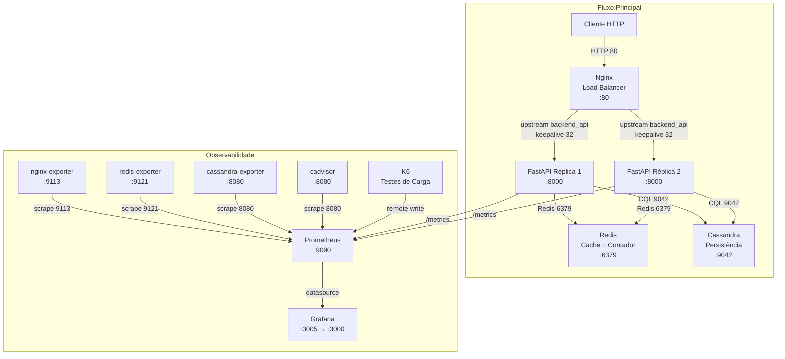
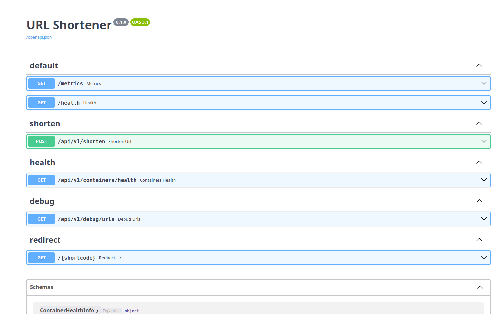
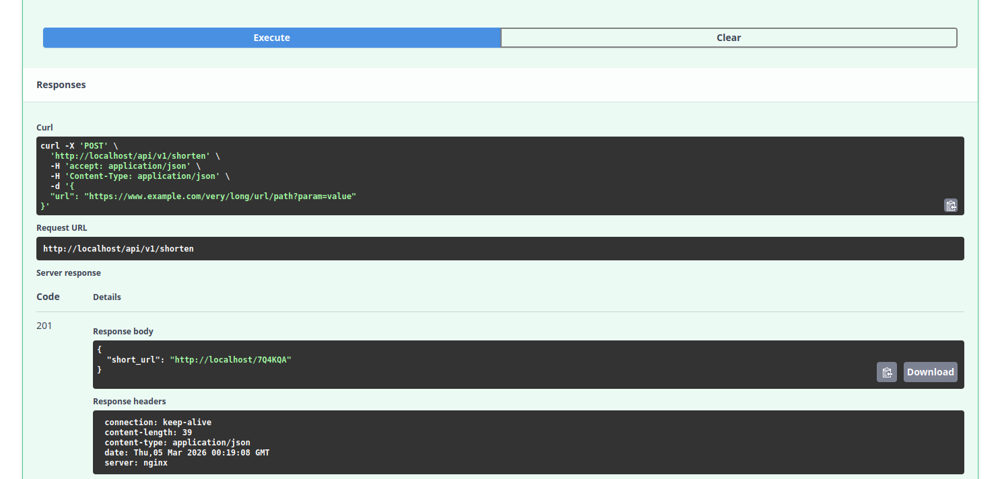

# URL Shortener System

> Sistema de encurtamento de URLs de alta performance, produção-ready e totalmente containerizado.


---

## 2. Visão Geral

Sistema de encurtamento de URLs projetado para suportar **10 milhões de URLs/dia** com ratio de **10:1 leitura:escrita** (90% leitura, 10% escrita), garantindo **alta disponibilidade 24/7** e **retenção de 10 anos** (TTL de **315.360.000 segundos** no Cassandra). Os shortcodes são gerados em **base62** (`[0-9A-Za-z]`) com mínimo de **4 caracteres**, utilizando contador atômico Redis + HashIds. A arquitetura é **produção-ready**, totalmente **containerizada** com Docker Compose, e segue os princípios **YAGNI** e **KISS** — priorizando simplicidade, legibilidade e responsabilidade única em cada módulo.

---

## 3. Desenho da Arquitetura



> **Nota:** O Docker Compose sobe **2 réplicas** do serviço `web` (`deploy.replicas: 2`), não são serviços separados. O Nginx distribui as requisições via upstream `backend_api` com `keepalive 32`.

---

## 4. Stack Tecnológica

| Camada | Tecnologia | Versão |
|--------|-----------|--------|
| Linguagem | Python | 3.12+ |
| Framework API | FastAPI | 0.115.0 |
| Servidor ASGI | Uvicorn | 0.30.6 |
| Banco de Dados | Apache Cassandra | 5.0 |
| Cache / Contador | Redis | 7.4-alpine |
| Load Balancer | Nginx | 1.27-alpine |
| Ofuscação de ID | HashIds | 1.3.1 (base62) |
| Validação | Pydantic | 2.8.2 |
| Configuração | pydantic-settings | 2.4.0 |
| HTTP Client (health) | httpx | 0.27.2 |
| Métricas API | prometheus-fastapi-instrumentator | 7.0.0 |
| Monitoramento | Prometheus | 2.54.1 |
| Dashboards | Grafana | 11.2.0 |
| Testes de Carga | K6 | 0.53.0 |
| Contêineres | Docker + Docker Compose | — |

### Exporters de Métricas

| Exporter | Imagem | Porta |
|----------|--------|-------|
| nginx-exporter | `nginx/nginx-prometheus-exporter:1.3.0` | 9113 |
| redis-exporter | `oliver006/redis_exporter:v1.62.0` | 9121 |
| cassandra-exporter | `criteord/cassandra_exporter:2.3.8` | 8080 |
| cadvisor | `gcr.io/cadvisor/cadvisor:v0.50.0` | 8080 |

---

## 5. Pré-requisitos

- **Docker** e **Docker Compose** (obrigatórios)
- **Git** (para clonar o repositório)
- **K6** (opcional — apenas para testes de carga executados localmente fora do Docker)

### Portas que devem estar livres

| Porta | Serviço |
|-------|---------|
| **80** | Nginx (Load Balancer) |
| **9090** | Prometheus |
| **3005** | Grafana |

---

## 6. Instruções de Execução

### 1. Clonar o repositório

```bash
git clone https://github.com/MoisesVNdev/url-shortener-system.git
cd url-shortener-system
```

### 2. Criar arquivo `.env`

Crie o arquivo `.env` na raiz do projeto com as variáveis de ambiente necessárias (consulte a [Seção 7 — Variáveis de Ambiente](#7-variáveis-de-ambiente)):

```bash
# .env (exemplo mínimo)
HASHIDS_SALT=minha_salt_secreta_aqui
BASE_URL=http://localhost
CACHE_TTL=86400
```

### 3. Inicializar a stack completa

```bash
docker compose up -d
```

> **⚠️ Atenção:** O Cassandra pode levar **até 60 segundos** para estar healthy (healthcheck com `interval: 30s`, `start_period: 90s`). Os serviços `web` só sobem após o Cassandra reportar saúde.

### 4. Verificar saúde do sistema

```bash
curl http://localhost/health
```

Resposta esperada:

```json
{"status": "ok", "redis": "connected", "cassandra": "connected"}
```

### 5. Testar encurtamento de URL

**Criar shortcode:**

```bash
curl -X POST http://localhost/api/v1/shorten \
  -H "Content-Type: application/json" \
  -d '{"url": "https://exemplo.com/artigo-longo"}'
```

Resposta (`201 Created`):

```json
{"short_url": "http://localhost/D4p5"}
```

**Acessar shortcode (redirecionamento):**

```bash
curl -v http://localhost/D4p5
```

Resposta (`302 Found`):

```
< HTTP/1.1 302 Found
< Location: https://exemplo.com/artigo-longo
```

### 6. Executar testes de carga (K6 via Docker)

```bash
docker compose --profile testing up k6
```

---

## 7. Variáveis de Ambiente

Todas as variáveis são carregadas via arquivo `.env` na raiz do projeto utilizando **pydantic-settings** (classe `Settings` em `app/core/config.py`).

| Variável | Tipo | Default | Descrição |
|----------|------|---------|-----------|
| `APP_HOST` | `str` | `0.0.0.0` | Host da aplicação |
| `APP_PORT` | `int` | `8000` | Porta da aplicação |
| `BASE_URL` | `str` | `http://localhost` | URL base para shortcodes gerados |
| `CASSANDRA_HOST` | `str` | `cassandra` | Host do Cassandra |
| `CASSANDRA_PORT` | `int` | `9042` | Porta CQL |
| `CASSANDRA_KEYSPACE` | `str` | `url_shortener` | Keyspace |
| `CASSANDRA_DC` | `str` | `datacenter1` | Datacenter para load balancing |
| `CASSANDRA_USER` | `str` | `""` | Usuário (vazio = sem auth) |
| `CASSANDRA_PASSWORD` | `str` | `""` | Senha (vazio = sem auth) |
| `REDIS_HOST` | `str` | `redis` | Host do Redis |
| `REDIS_PORT` | `int` | `6379` | Porta do Redis |
| `HASHIDS_SALT` | `str` | `""` | **⚠️ Salt para HashIds — DEVE ser definido em produção!** |
| `CACHE_TTL` | `int` | `86400` | TTL do cache em segundos (24h) |
| `WEB1_HOST` | `str` | `web` | Host da réplica 1 (health check) |
| `WEB2_HOST` | `str` | `web` | Host da réplica 2 (health check) |
| `WEB_APP_PORT` | `int` | `8000` | Porta das réplicas |
| `WEB_HEALTH_PATH` | `str` | `/health` | Path do health check |
| `NGINX_HOST` | `str` | `nginx` | Host do Nginx |
| `NGINX_PORT` | `int` | `80` | Porta do Nginx |
| `NGINX_HEALTH_PATH` | `str` | `/health` | Health path do Nginx |

> **🔐 Segurança:** A variável `HASHIDS_SALT` **DEVE** ser definida em produção com um valor secreto e consistente entre todas as réplicas. Com salt vazio, os shortcodes são previsíveis e potencialmente inseguros.

---

## 8. Endpoints da API

### Tabela de Endpoints

| Método | Endpoint | Descrição | Status |
|--------|----------|-----------|--------|
| `POST` | `/api/v1/shorten` | Cria shortcode para URL | `201 Created` |
| `GET` | `/{shortcode}` | Redireciona para URL original | `302 Found` / `404 Not Found` |
| `GET` | `/health` | Health check da aplicação | `200 OK` |
| `GET` | `/api/v1/containers/health` | Health de todos os containers | `200 OK` |
| `GET` | `/api/v1/debug/urls` | Debug: lista URLs e top acessos | `200 OK` |
| `GET` | `/metrics` | Métricas Prometheus | `200 OK` |

<details>
<summary>📸 Swagger UI — Documentação interativa da API</summary>



</details>

---

### `POST /api/v1/shorten`

Cria um shortcode para a URL fornecida.

**Request:**

```bash
curl -X POST http://localhost/api/v1/shorten \
  -H "Content-Type: application/json" \
  -d '{"url": "https://exemplo.com/artigo-longo"}'
```

**Response (`201 Created`):**

```json
{
  "short_url": "http://localhost/D4p5"
}
```

<details>
<summary>📸 Exemplo real no Swagger UI</summary>



</details>

**Schema de entrada** (`ShortenRequest`):

| Campo | Tipo | Obrigatório | Descrição |
|-------|------|-------------|-----------|
| `url` | `AnyHttpUrl` | Sim | URL original a ser encurtada |

---

### `GET /{shortcode}`

Redireciona para a URL original com base no shortcode.

**Validação do shortcode:** regex `^[0-9A-Za-z]{4,}$` (mínimo 4 caracteres, apenas alfanuméricos).

**Request:**

```bash
curl -v http://localhost/D4p5
```

**Response (`302 Found`):**

```
< HTTP/1.1 302 Found
< Location: https://exemplo.com/artigo-longo
```

**Response (`404 Not Found`):**

```json
{
  "detail": "Shortcode não encontrado."
}
```

---

### `GET /health`

Health check da aplicação com verificação de Redis e Cassandra.

**Request:**

```bash
curl http://localhost/health
```

**Response (`200 OK`):**

```json
{
  "status": "ok",
  "redis": "connected",
  "cassandra": "connected"
}
```

**Response (degradado):**

```json
{
  "status": "degraded",
  "error": "Connection refused"
}
```

---

### `GET /api/v1/containers/health`

Verifica a saúde de todos os containers do sistema (web réplicas, Nginx, Redis, Cassandra).

**Request:**

```bash
curl http://localhost/api/v1/containers/health
```

**Response (`200 OK`):**

```json
{
  "status": "healthy",
  "checked_at": "2026-03-02T12:00:00Z",
  "summary": {
    "total": 5,
    "healthy": 5,
    "unhealthy": 0
  },
  "containers": [
    {
      "service": "redis",
      "type": "redis",
      "host": "redis",
      "port": 6379,
      "status": "healthy",
      "latency_ms": 1.23,
      "version": "7.4.0",
      "details": {"mode": "standalone"}
    },
    {
      "service": "cassandra",
      "type": "cassandra",
      "host": "cassandra",
      "port": 9042,
      "status": "healthy",
      "latency_ms": 5.67,
      "version": "5.0"
    }
  ]
}
```

---

### `GET /api/v1/debug/urls`

Endpoint de diagnóstico. Retorna registros do Cassandra e ranking de shortcodes mais acessados via Redis.

> ⚠️ Não expor em produção.

**Parâmetros de query:**

| Parâmetro | Tipo | Default | Range | Descrição |
|-----------|------|---------|-------|-----------|
| `limit` | `int` | `50` | 1–500 | Máximo de registros retornados |
| `top` | `int` | `10` | 1–100 | Quantidade de shortcodes mais acessados |

**Request:**

```bash
curl "http://localhost/api/v1/debug/urls?limit=10&top=5"
```

**Response (`200 OK`):**

```json
{
  "total": 3,
  "records": [
    {
      "shortcode": "D4p5",
      "long_url": "https://exemplo.com/artigo-longo",
      "created_at": "2026-03-02T10:30:00Z"
    },
    {
      "shortcode": "Kx9R",
      "long_url": "https://exemplo.com/outro-artigo",
      "created_at": "2026-03-02T11:00:00Z"
    }
  ],
  "top_shortcodes": [
    {"shortcode": "D4p5", "hits": 1542},
    {"shortcode": "Kx9R", "hits": 87}
  ]
}
```

---

### `GET /metrics`

Métricas Prometheus expostas automaticamente via `prometheus-fastapi-instrumentator`.

**Request:**

```bash
curl http://localhost/metrics
```

**Response (`200 OK`):** Formato texto Prometheus (métricas de requisições, latência, status codes, etc.).

---

## 9. Testes de Carga e Performance (K6)

Todos os testes estão localizados em `tests/k6/`.

### Tipos de Teste

| Teste | Arquivo | VUs / Rate | Duração | Objetivo |
|-------|---------|-----------|---------|----------|
| **Smoke** | `smoke_test.js` | 2 VUs | 1 min | Validação básica de sanidade |
| **Load** | `load_test.js` | 100 req/s (10 write + 90 read) | 1 min | Carga sustentada ratio 10:1 |
| **Stress** | `stress_test.js` | Rampa até 5x carga normal | 15 min | Encontrar ponto de ruptura |
| **Spike** | `spike_test.js` | Picos repentinos | 7 min | Comportamento sob picos |
| **Soak** | `soak_test.js` | 50 req/s | 30 min+ | Detectar memory leaks |

### Thresholds (SLOs)

| Métrica | Threshold |
|---------|-----------|
| P95 escrita | < 500ms |
| P95 leitura | < 100ms |
| P99 global | < 1s |
| Taxa de erro | < 1% |

### Execução

**Via script local — teste individual (requer K6 instalado):**

```bash
./tests/k6/run_k6.sh <teste> [--open-report]
```

Exemplos:

```bash
./tests/k6/run_k6.sh smoke              # Smoke test
./tests/k6/run_k6.sh load --open-report # Load test + abrir relatório HTML
./tests/k6/run_k6.sh stress             # Stress test
```

**Via script local — execução sequencial (smoke + load + stress + spike):**

```bash
./tests/k6/run_all_tests.sh              # Executa 4 testes (~24 min)
./tests/k6/run_all_tests.sh --open-reports  # Abre todos os relatórios HTML
```

> ⏱️ Duração total: ~24 minutos | 🚫 Não inclui soak_test (8h) — execute manualmente se necessário.

**Via Docker (executa apenas load_test — envia métricas ao Prometheus):**

```bash
docker compose --profile testing up k6
```

### Relatórios

Os relatórios são gerados automaticamente em:

```
tests/k6/results/{teste}_test-summary-{timestamp}.html
tests/k6/results/{teste}_test-summary-{timestamp}.json
```

### Resultados dos Testes

<details>
<summary>🔍 Smoke Test (2 VUs — 1 min)</summary>

#### Detailed Metrics


#### Test Run Details


#### Checks & Groups


</details>

<details>
<summary>📊 Load Test (100 req/s — 1 min)</summary>

#### Detailed Metrics


#### Test Run Details


#### Checks & Groups


</details>

<details>
<summary>💥 Stress Test (rampa até 5x — 15 min)</summary>

#### Detailed Metrics


#### Test Run Details


#### Checks & Groups


</details>

<details>
<summary>⚡ Spike Test (picos repentinos — 7 min)</summary>

#### Detailed Metrics


#### Test Run Details


#### Checks & Groups


</details>

---

## 10. Observabilidade e Monitoramento

### Stack de Observabilidade

| Componente | Porta | Função |
|------------|-------|--------|
| **Prometheus** | `9090` | Coleta e armazenamento de métricas |
| **Grafana** | **`3005`** (externa) → `3000` (interna) | Visualização de dashboards |
| **Logs estruturados** | — | JSON via módulo `logging` (nunca `print()`) |

### Credenciais padrão do Grafana

| Campo | Valor |
|-------|-------|
| Usuário | `admin` |
| Senha | `admin` |

### Dashboards

Dashboards provisionados automaticamente na pasta **"K6 Load Tests"** via Grafana provisioning.

### Exporters Dedicados

4 exporters coletam métricas dos serviços de infraestrutura:

| Exporter | Target | Porta | Métricas |
|----------|--------|-------|----------|
| **nginx-exporter** | Nginx | 9113 | Conexões ativas, requisições/s, status |
| **redis-exporter** | Redis | 9121 | Memória, comandos/s, hit rate, clientes |
| **cassandra-exporter** | Cassandra | 8080 | Latência CQL, compactações, heap |
| **cadvisor** | Docker | 8080 | CPU, memória, rede, disco por container |

### FastAPI `/metrics`

O endpoint `/metrics` é exposto automaticamente via `prometheus-fastapi-instrumentator`, fornecendo métricas de requisições HTTP (contagem, latência por percentil, status codes).

### Métricas Principais

- Requisições por segundo
- Latência P50 / P95 / P99
- Taxa de erro
- Hit rate do cache Redis
- Estado do Cassandra
- Uso de recursos dos containers (CPU, memória, rede)

### Configuração do Prometheus

- **Scrape interval:** 5s
- **Retenção:** 7 dias
- **Remote write receiver:** habilitado (para K6)

---

## 11. Estrutura do Projeto

| Diretório | Responsabilidade |
|-----------|-----------------|
| `app/api/v1/endpoints/` | Rotas HTTP (FastAPI routers) |
| `app/schemas/` | Schemas Pydantic v2 (entrada/saída) |
| `app/services/` | Lógica de negócio (shortcode, cache, url_service) |
| `app/db/` | Conexões Cassandra e Redis (singletons) |
| `app/core/` | Configuração centralizada (pydantic-settings) |
| `infra/` | Configurações de infraestrutura (Nginx, Cassandra, Prometheus, Grafana) |
| `tests/unit/` | Testes unitários (pytest + pytest-asyncio) |
| `tests/k6/` | Testes de carga (K6) |
| `tests/postman/` | Coleção Postman para testes manuais da API |

---

## 12. Desenvolvimento e Contribuição

### Testes unitários

```bash
pytest --cov=app --cov-report=html
```

### Padrões de código

- **Tipagem obrigatória** em todas as funções públicas
- **Async/await** para todo I/O (Cassandra, Redis, HTTP)
- **Docstrings em português** no formato Google Style
- **Ruff** como formatter (substitui Black + isort + flake8)
- Máximo **120 caracteres** por linha
- Nunca usar `print()` — utilizar `logging` estruturado

### Guidelines

Consulte os arquivos de instrução em `.github/instructions/` para guidelines detalhados:

| Arquivo | Contexto |
|---------|----------|
| `python.instructions.md` | Ao editar arquivos `.py` |
| `docker.instructions.md` | Ao editar `Dockerfile` ou `docker-compose.yml` |
| `api.instructions.md` | Ao editar rotas, schemas e services |
| `tests.instructions.md` | Ao escrever ou revisar testes |

### Docker

O Dockerfile usa **multi-stage build** (builder + runner) com usuário não-root (`appuser`) para segurança.

---

## 13. Troubleshooting

### Problemas Comuns

| Problema | Causa Provável | Solução |
|----------|---------------|---------|
| Cassandra demora para iniciar | Healthcheck com interval de 30s, startup pode levar 60s+ | Aguardar ou verificar: `docker compose logs -f cassandra` |
| `Connection refused` no Redis | Container ainda não ready ou porta 6379 ocupada | `docker compose ps` para verificar status |
| Nginx retorna 502 Bad Gateway | Réplicas web ainda não healthy | Verificar: `docker compose logs -f web` |
| Shortcodes repetidos | `HASHIDS_SALT` vazio ou diferente entre réplicas | Definir `HASHIDS_SALT` no `.env` compartilhado |
| Cache não funciona | `CACHE_TTL=0` ou Redis sem memória | Verificar `maxmemory 256mb` e política `volatile-lru` |
| Métricas não aparecem no Grafana | Prometheus não scraping ou datasource errado | Verificar `http://localhost:9090/targets` |

### Comandos de Diagnóstico

```bash
# Ver logs de um serviço específico
docker compose logs -f <serviço>
# Serviços: cassandra, redis, web, nginx, prometheus, grafana

# Verificar status de todos os containers
docker compose ps

# Reiniciar um serviço específico
docker compose restart <serviço>
```

---

## 14. Testes Manuais (Postman)

A coleção Postman para testes manuais da API está disponível em `tests/postman/URL_Shortener_Collection.json`.

**Como importar:**

1. Abra o Postman
2. Clique em **Import** → **Upload Files**
3. Selecione o arquivo `tests/postman/URL_Shortener_Collection.json`
4. A variável `{{base_url}}` já está configurada para `http://localhost`

A coleção inclui requests organizados para todos os endpoints da API: health check, criação de shortcodes, redirecionamento, health de containers e debug.

---

## 15. Inspiração

Este projeto foi inspirado pelo vídeo **[Arquitetando um Encurtador de URL: O Maior Desafio dos Programadores em Entrevistas de System Design](https://www.youtube.com/watch?v=m_anIoKW7Jg)** do canal **[Renato Augusto](https://www.youtube.com/@RenatoAugustoTech)**. A arquitetura apresentada no vídeo serviu como base para o desenvolvimento deste encurtador de URL, ao qual acrescentei testes unitários, testes de carga (K6) e uma stack completa de observabilidade para validação da API em cenários reais de produção.

Obrigado, Renato, pelo conteúdo de qualidade que motivou a criação deste projeto!

---

## 16. Licença e Contato

Este projeto está licenciado sob a **MIT License** — consulte o arquivo [LICENSE](LICENSE) para detalhes.

- **Repositório:** [https://github.com/MoisesVNdev/url-shortener-system](https://github.com/MoisesVNdev/url-shortener-system)
- **Issues:** [https://github.com/MoisesVNdev/url-shortener-system/issues](https://github.com/MoisesVNdev/url-shortener-system/issues)
- **LinkedIn:** [https://www.linkedin.com/in/moisesvnoliveira/](https://www.linkedin.com/in/moisesvnoliveira/)
- **Email:** moisesvn.dev@gmail.com

---

## Checklist de Validação Anti-Alucinação

- [x] Todas as 6 métricas da seção "Métricas de Escala" aparecem no texto (10M URLs/dia, ratio 10:1, 24/7, 10 anos, TTL 315.360.000s, base62 mínimo 4 chars)
- [x] O endpoint de redirect está como `GET /{shortcode}` (NÃO `/api/v1/redirect/{shortcode}`)
- [x] Todos os 6 endpoints da tabela estão documentados com exemplos
- [x] O diagrama Mermaid inclui os 4 exporters e o K6
- [x] A tabela de variáveis de ambiente tem TODAS as 19 variáveis
- [x] `HASHIDS_SALT` está destacado como crítico para produção
- [x] Grafana está na porta **3005** (não 3000)
- [x] K6 via Docker usa `--profile testing`
- [x] Nenhuma tecnologia foi adicionada que não está na stack listada
- [x] Todos os blocos de código têm syntax highlighting correto
- [x] Coleção Postman documentada (`tests/postman/URL_Shortener_Collection.json`)
- [x] LinkedIn e email de contato presentes
- [x] Seção de inspiração com créditos ao vídeo do Renato Augusto
- [x] Licença MIT referenciada corretamente